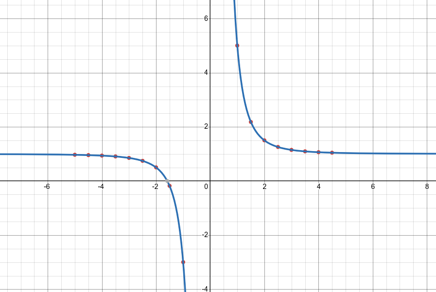

# Домашнее задание по АЯ. Калькулятор.

## Описание

- Данная программа принимает на вход математическое выражение и в зависимости от него высчитывает результат.
- Программа содержит в себе класс `CalcGraph`, который разбивает математическое выражение методом `Parse` и возвращает объект типа `std::function<const float(const float)>`, при вызове которого с параметром некоторой переменной `x` типа `float` высчитывается значение, такой подход позволяет уже в готовую конструкцию подавать в качестве аргумента разные значения переменной `x`.
- Также класс `CalcGraph` содержит в себе метод, который позволяет регистрировать математические функции методом `Register`, который принимает в себе имя математической функции и её реализацию. 

  Пример:

  ```cpp
  CalcGraph graph;
  graph.Register("cos",   [](const float t) -> const float {return std::cos(t);});
  graph.Register("sin",   [](const float t) -> const float {return std::sin(t);});
  graph.Register("tg",    [](const float t) -> const float {return std::tan(t);});
  graph.Register("ctg",   [](const float t) -> const float {return std::tan(3.14159265358 / 2.0 - t);}); //ctg(x) = tg(pi/2 - x)
  graph.Register("ln",    [](const float t) -> const float {return std::log(t);});
  graph.Register("exp",   [](const float t) -> const float {return std::exp(t);});
  graph.Register("cosh",  [](const float t) -> const float {return std::cosh(t);});
  graph.Register("sinh",  [](const float t) -> const float {return std::sinh(t);});
  graph.Register("tanh",  [](const float t) -> const float {return std::tanh(t);});
  graph.Register("coth",  [](const float t) -> const float {return 1.f / std::tanh(t);});
  graph.Register("sqrt",  [](const float t) -> const float {return std::sqrt(t);});
  graph.Register("arcsin",[](const float t) -> const float {return std::asin(t);});
  graph.Register("arccos",[](const float t) -> const float {return std::acos(t);});
  graph.Register("arctg", [](const float t) -> const float {return std::atan(t);});
  graph.Register("arcctg",[](const float t) -> const float {return 3.14159265358 / 2.0 - std::atan(t);});
  ```
- Также метод `Parse` содержит в себе проверку на правильность введёной математической строки.

  Пример:

  ```cpp
  auto res_func1 = graph.Parse("((x+x"); //error! нет закрытых скобок!
  auto res_func2 = graph.Parse("x+x))"); //error! нет открывающихся скобок!
  auto res_func3 = graph.Parse(""); //error! пустая строка!
  auto res_func4 = graph.Parse("exp"); //error! нельзя преобразовать в число!
  auto res_func5 = graph.Parse("exp()"); //error! нет аргумента у 'exp'
  auto res_func6 = graph.Parse("exp(0)"); //valid! res_func6(0) = res_func6(1) = ... = 1, нет зависимости от x
  auto res_func7 = graph.Parse("ln(x+sqrt(x*x+1))"); //valid! res_func7(0) = 0; res_func7(1) = 0.881374
  auto res_func8 = graph.Parse("coooooos(1)"); // error! данная функция не зарегестрирована.
  ```

## Принцип работы

- В принципе работы класса `CalcGraph` лежит дерево, которое разбивает сложную строку на более простые выражения.
- Шаги его работы:
    - Итерируемся по строке и смотрим на вхождение первого `свободного` знака `+` или `-` , под `свободным` имеется в виду, чтобы он не был внутри скобок. Таким образом разбили строку на 2 части, которые вновь пойдут в метод `Parse` и пойдёт всё с 1 шага.
    - Если предыдущий пункт не выполняется, то итерируемся по строке и смотрим на вхождение первого свободного знака `*` и `/`. Таким образом опять же разбили строку на строки, которые вновь пойдут в метод `Parse` и начнётся с 1 шага.
    - Если прошлый пункт не выполняется, значит у нас остались функции, которые сами зарегистрировали. Таким образом, опять разбиваем строку. Аргумент, который содержится в другой математической функции, отправляем вновь в метод `Parse`, где всё начинается с 1 шага.
    - Если прошлые пункты не выполняются, значит выражение скорее всего находится в скобках, поэтому проверяем на наличие скобок с начала и с конца, если такие есть, то избавляемся от них и вновь передаём в `Parse` где всё начинается с 1 шага.
    - Если уже и предыдущие шаги не выполняются, значит у нас уже идут просто численные значения или переменные, которые уже вставляются в выражения и высчитываются.

## Пример использования:

```cpp
#include <CalcGraph/CalcGraph.hpp>
#include <iostream>
#include <cmath>
#include <iomanip>


int main(){
	CalcGraph graph;
	auto func = graph.Parse("(x*x*x+4)/(x*x*x)"); // y = (x^3 + 4) / x^3
	for(float x = -5.f; x < 5.f; x+=0.5f){
		std::cout << "x: " << std::setw(4) << x << " func: " << func(x) << std::endl;
	}
}
```

- Вывод:

```
x:   -5 func: 0.968
x: -4.5 func: 0.956104
x:   -4 func: 0.9375
x: -3.5 func: 0.906706
x:   -3 func: 0.851852
x: -2.5 func: 0.744
x:   -2 func: 0.5
x: -1.5 func: -0.185185
x:   -1 func: -3
x: -0.5 func: -31
x:    0 func: inf
x:  0.5 func: 33
x:    1 func: 5
x:  1.5 func: 2.18519
x:    2 func: 1.5
x:  2.5 func: 1.256
x:    3 func: 1.14815
x:  3.5 func: 1.09329
x:    4 func: 1.0625
x:  4.5 func: 1.0439
```

Результат Desmos (y = (x^3 + 4) / x^3):



## Сборка

- Для сборки проекта требуется наличие компилятора со стандартом `C++20` и CMake с минимальной версией `3.10`, также необходимо выполнить следующие команды.

```bash
git clone https://github.com/Gigachader007/SmartCalculator
cd SmartCalculator
mkdir build && cd build
cmake ..
make
```

